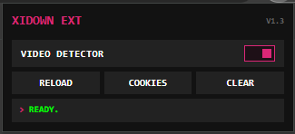

# xidown ext

Browser companion for the **xidown** video and audio downloader, featuring automatic media stream detection and cookie synchronization.

---

## Preview

| Extension Popup (Terminal Interface) | Floating DL Button |
| :---: | :---: |
|  |  |

---

## Features

- **Smart Media Sniffer:** Detects and intercepts `.m3u8` and `.mp4` streams. Excludes junk/ad URLs, automatically parses resolutions (e.g., `1080p`), and categorizes streams (`VIDEO+AUDIO`, `VIDEO ONLY`, `AUDIO ONLY`).
- **Header & Cookie Cloner:** Automatically clones critical request headers (Cookies, User-Agent, Referer, Origin) to bypass restrictions and age-gates.
- **One-Click Cookie Sync:** Instantly extracts and formats page cookies into a Netscape HTTP cookie file, syncing it with the local xidown server.
- **Seamless Local Integration:** Sends media URLs, cloned headers, and sanitized titles directly to the local downloader at `http://localhost:3000/download`.
- **Brutalist Terminal UI:** A compact, high-contrast dark theme featuring a global sniffing toggle, real-time status feedback, and quick actions (reload/clear).

---

## Main Downloader Application (xidown)

> [!IMPORTANT]
> This extension requires the main **xidown** desktop application to be running locally on your machine (`http://localhost:3000`) in order to capture and process streams.

- **Main Repository:** [github.com/indravoyager/xidown](https://github.com/indravoyager/xidown)
- **Standalone Downloads:** [xidown Releases Page](https://github.com/indravoyager/xidown/releases) (Pre-compiled for Windows, macOS, and Linux)

### Quick Setup for the Main App:
1. **Download:** Go to the [xidown Releases](https://github.com/indravoyager/xidown/releases) page and grab the `.zip` archive for your OS.
2. **Launch:**
   - **Windows:** Extract and run `xidown.exe` (automatically creates a desktop shortcut on the first launch!).
   - **macOS:** Extract and double-click `xidown.app`.
   - **Linux:** Extract, make executable (`chmod +x xidown`), and run `./xidown`.
3. **Developer Mode (Run from Source):** Clone the main repository, create a python virtual environment, and run `pip install -e .` followed by the `xidown` command.

---

## Installation & Setup (Extension)

1. Clone or download this repository to your local system:
   ```bash
   git clone https://github.com/indravoyager/xidown_ext.git
   ```
2. Open Google Chrome and navigate to:
   ```text
   chrome://extensions/
   ```
3. Enable **Developer mode** by toggling the switch in the top-right corner.
4. Click **Load unpacked** in the top-left corner.
5. Select the `xidown_ext` directory (containing `manifest.json`).

---

## Project Structure

```text
xidown_ext/
├── assets/
│   ├── xidown_overlay.png # Floating DL button preview
│   └── xidown_popupv1.3.png # Extension preview screenshot
├── img/
│   └── icon.png           # Extension icon assets
├── popup/
│   ├── popup.html         # Terminal-style HTML layout and stylesheet
│   └── popup.js           # Media downloader and cookie synchronisation controller
├── scripts/
│   ├── background.js      # Background service worker for header sniffing and badge counters
│   └── content.js         # Content script for page title detection and inline DL overlay buttons
├── .gitignore             # Standard OS/IDE ignore patterns
├── LICENSE                # MIT License
├── manifest.json          # Chrome Extension Manifest v3 configuration
└── README.md              # Documentation and usage guide
```

---

## How It Works

1. **Sniffing:** When you visit a website containing videos, `background.js` intercepts network traffic and looks for `.m3u8` and `.mp4` files.
2. **Notification:** Once a media file is detected, the extension icon badge updates with a `!` notification.
3. **Download:** Open the extension popup, check the detected media list (sorted by quality), and click any item. It will send the stream URL along with all required referer/cookie headers to your local xidown desktop application at `http://localhost:3000/download`.
4. **Cookie Sync:** If a video requires authentication, click the **Cookies** button to sync the Netscape Cookie file to your local xidown app for download authentication.

---

## Contributing

Pull requests are welcome. For major changes, please open an issue first to discuss what you would like to change.

---

## License

[MIT](LICENSE)
