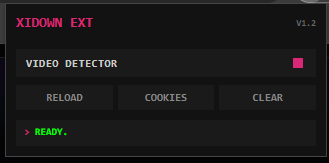
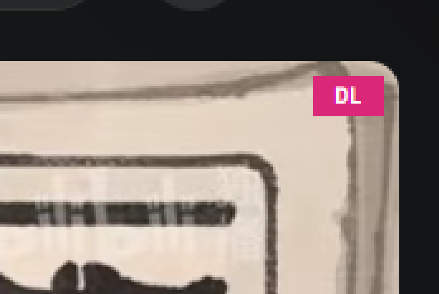

# Xidown Ext

Xidown Ext is a powerful, minimal, and brutalist Chrome Extension designed for media stream detection, advanced request header sniffing, cookie synchronisation, and direct integration with the local Xidown downloader application. It features a space-saving terminal aesthetic with sharp, 90-degree corners, monospace fonts, and vibrant pink highlights.

## Preview

| Extension Popup (Terminal Interface) | Floating DL Button |
| :---: | :---: |
|  |  |

## Features

- **Flat & Brutalist Terminal Design:** Clean, space-saving UI with sharp 90-degree corners, monospace fonts, and high-contrast status colors.
- **Smart Media Detector:**
  - Automatically captures `.m3u8` playlists and `.mp4` video files.
  - Excludes junk/noise URLs (ads, doubleclick, analytics, pixels).
  - Shows dynamic badge counts and colors on the extension icon depending on file types (MP4 vs M3U8).
- **Advanced Header Sniffing:** Clones critical request headers (including Cookies, User-Agent, Referer, Origin, Authorization, and Accept-Language) for seamless authenticated downloads.
- **Direct Local App Integration:** Send download links, cookies, and header packages directly to the local Xidown server (`http://localhost:3000/download`) with visual status feedback.
- **Cookie Export & Sync:** Send page-specific cookies formatted as a Netscape HTTP Cookie File to the local server for authenticated stream fetching.
- **Resolution Detection & Quality Filtering:** Parses URLs to extract and display resolution tags (e.g., `1080p`, `720p`), categorizes media type (`VIDEO + AUDIO`, `AUDIO ONLY`, `VIDEO ONLY`), and automatically sorts results by quality.
- **Smart Filename Sanitisation:** Standardises file titles by stripping notification numbers (e.g. `(1)`), website suffixes (`YouTube`, `PikPak`, `Facebook`, `Bilibili`), and unsafe operating system filename characters.

## Installation & Setup

1. Clone or download this repository to your local system:
   ```bash
   git clone https://github.com/indravoyager/xidown_ext.git
   ```
2. Open Google Chrome and navigate to:
   ```text
   chrome://extensions/
   ```
3. Enable **Developer mode** by toggling the switch in the top-right corner.
4. Click **Load unpacked** in the top-left corner.
5. Select the `xidown_ext` directory (containing `manifest.json`).

## Project Structure

```text
xidown_ext/
├── assets/
│   ├── xidown_overlay.png # Floating DL button preview
│   └── xidown_popup.png   # Extension preview screenshot
├── img/
│   └── icon.png           # Extension icon assets
├── popup/
│   ├── popup.html         # Terminal-style HTML layout and stylesheet
│   └── popup.js           # Media downloader and cookie synchronisation controller
├── scripts/
│   ├── background.js      # Background service worker for header sniffing and badge counters
│   └── content.js         # Content script for page title detection and inline DL overlay buttons
├── .gitignore             # Standard OS/IDE ignore patterns
├── LICENSE                # MIT License
├── manifest.json          # Chrome Extension Manifest v3 configuration
└── README.md              # Documentation and usage guide
```

## How It Works

1. **Sniffing:** When you visit a website containing videos, `background.js` intercepts network traffic and looks for `.m3u8` and `.mp4` files.
2. **Notification:** Once a media file is detected, the extension icon badge updates with a `!` notification.
3. **Download:** Open the extension popup, check the detected media list (sorted by quality), and click any item. It will send the stream URL along with all required referer/cookie headers to your local Xidown desktop application at `http://localhost:3000/download`.
4. **Cookie Sync:** If a video requires authentication, click the **Cookies** button to sync the Netscape Cookie file to your local Xidown app for download authentication.

## Contributing

Pull requests are welcome. For major changes, please open an issue first to discuss what you would like to change.

## License

[MIT](LICENSE)
